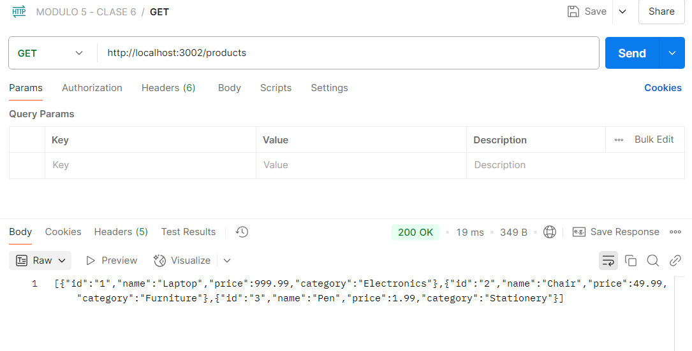
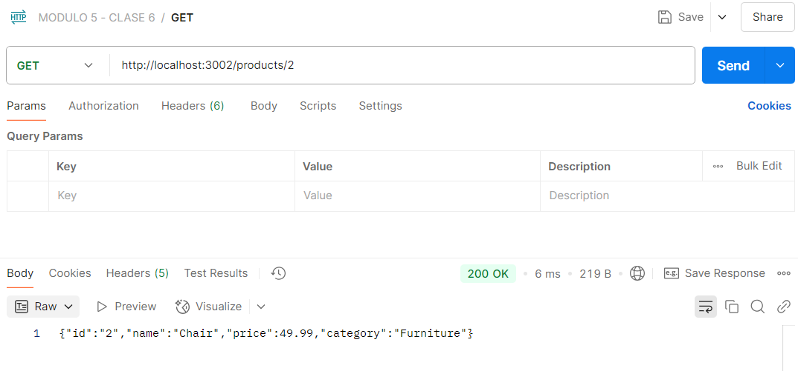
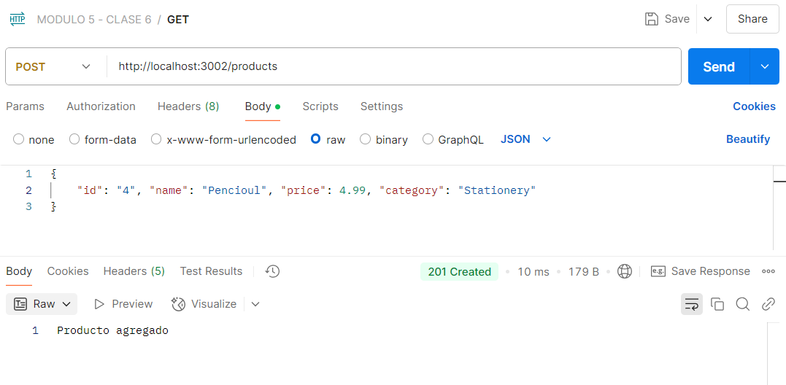
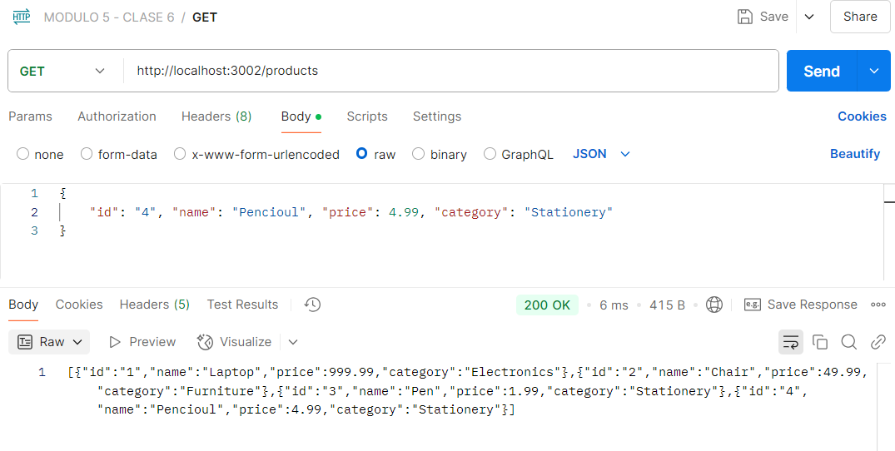
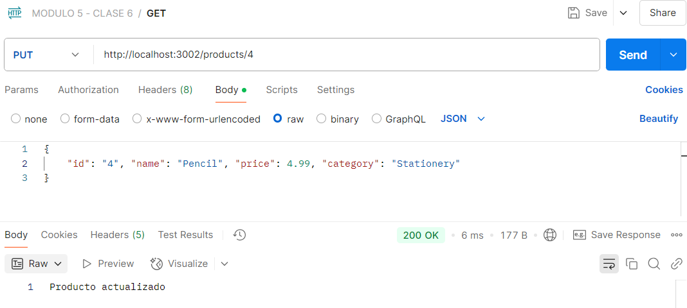
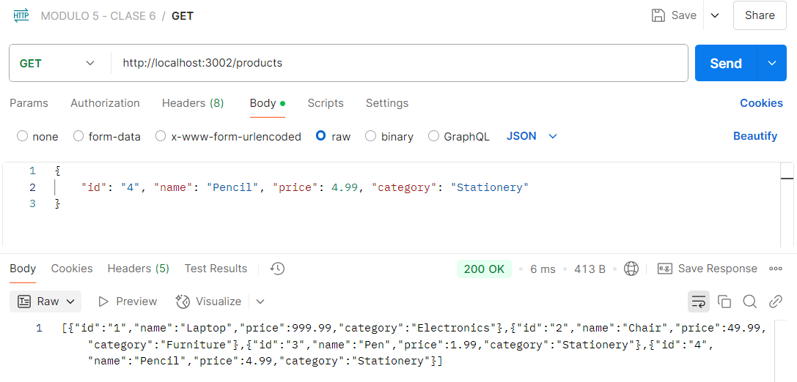
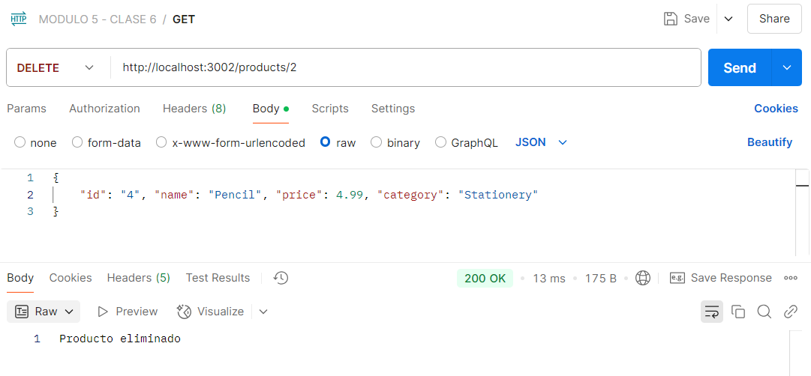
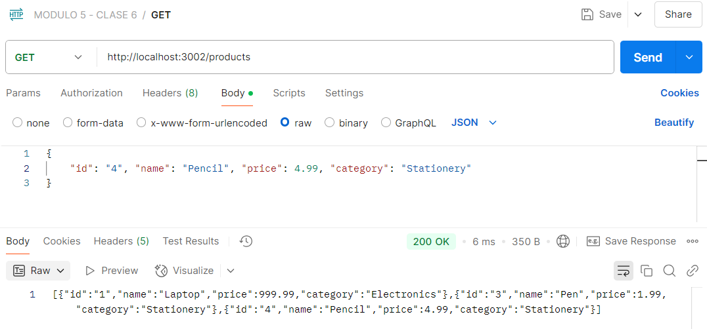

# API Básica en Node.js

Este proyecto es una API REST básica con Node.js. La API maneja un conjunto de productos y permite realizar operaciones CRUD (Crear, Leer, Actualizar y Eliminar) utilizando peticiones HTTP.
La La API estará corriendo en el puerto 3002.

## Endpoints disponibles

### Obtener todos los productos
**Ruta:** GET /products  
**Respuesta:** Lista de todos los productos en formato JSON.



### Obtener un producto por ID
**Ruta:** GET /products/:id  
**Parámetros:** id (string) - ID del producto a obtener.  
**Respuesta:** Detalles del producto en formato JSON.



### Crear un nuevo producto
**Ruta:** POST /products  
Cuerpo de la petición: JSON con los siguientes campos:
```bash
{
  "id": "4",
  "name": "Nuevo Producto",
  "price": 25.99,
  "category": "Categoria"
}
```
**Respuesta:** Producto creado.




### Actualizar un producto
**Ruta:** PUT /products/:id  
**Parámetros:** id (string) - ID del producto a actualizar.  
**Respuesta:** Mensaje de confirmación.




### Eliminar un producto
**Ruta:** DELETE /products/:id


