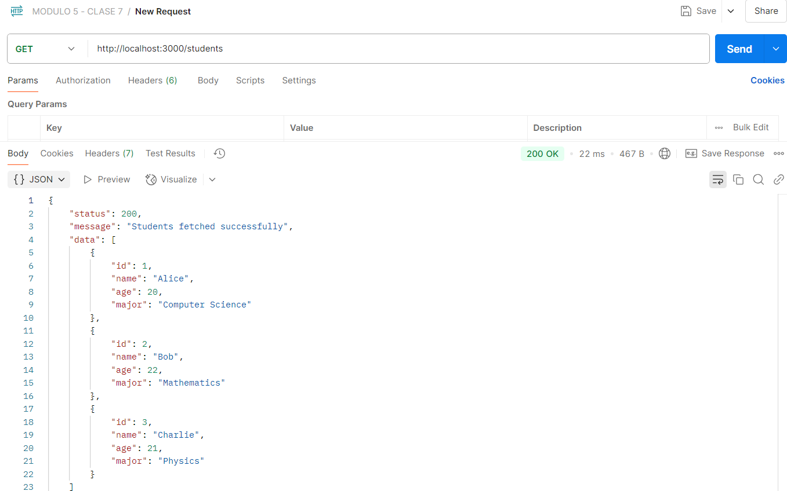
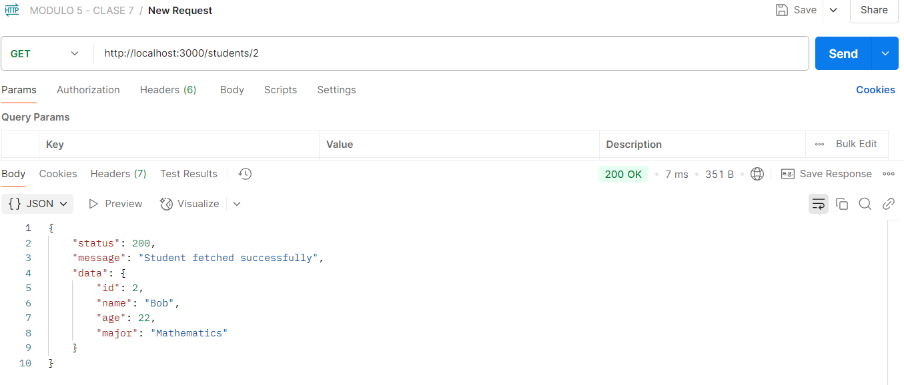
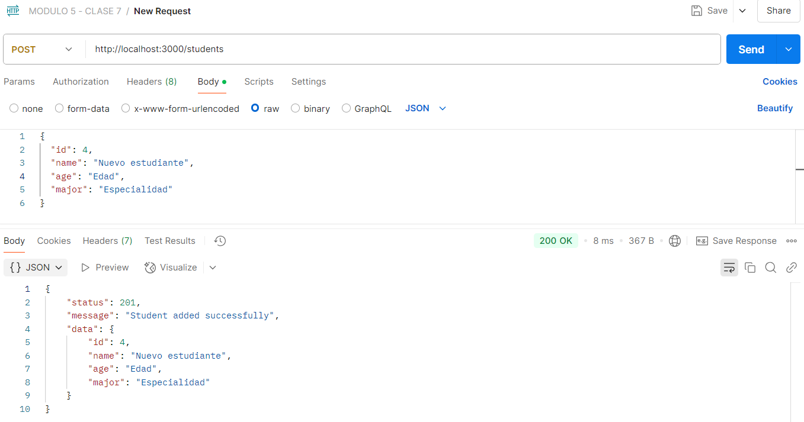
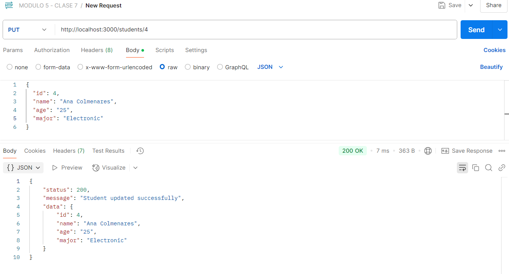
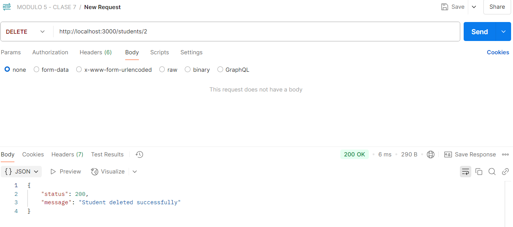
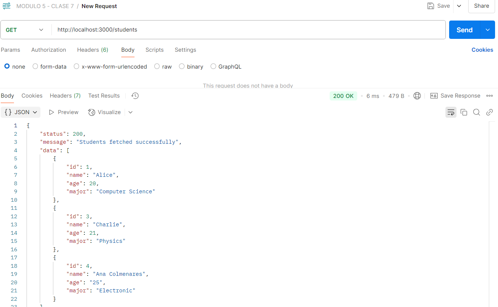

# API Básica con Express

Este proyecto es una API básica con Express. La API maneja un conjunto de estudiantes y permite realizar operaciones CRUD (Crear, Leer, Actualizar y Eliminar) utilizando peticiones HTTP.
La La API estará corriendo en el puerto 3000.

## Endpoints disponibles

### Obtener todos los estudiantes
**Ruta:** GET /students  
**Respuesta:** Lista de todos los estudiantes en formato JSON.


### Obtener un estudiante por ID
**Ruta:** GET /students/:id  
**Parámetros:** id (string) - ID del estudiante a obtener.  
**Respuesta:** Detalles del estudiante en formato JSON.


### Crear un nuevo estudiante
**Ruta:** POST /students  
**Cuerpo de la petición:** JSON con los siguientes campos:
```bash
{
  "id": "Id",
  "name": "Nuevo estudiante",
  "age": "Edad",
  "major": "Especialidad"
}
```
**Respuesta:** Student fetched successfully.


### Actualizar un estudiante
**Ruta:** PUT /students/:id  
**Parámetros:** id (string) - ID del estudiante a actualizar.  
**Respuesta:** Student updated successfully.


### Eliminar un estudiante
**Ruta:** DELETE /students/:id  
**Respuesta:** Student deleted successfully

