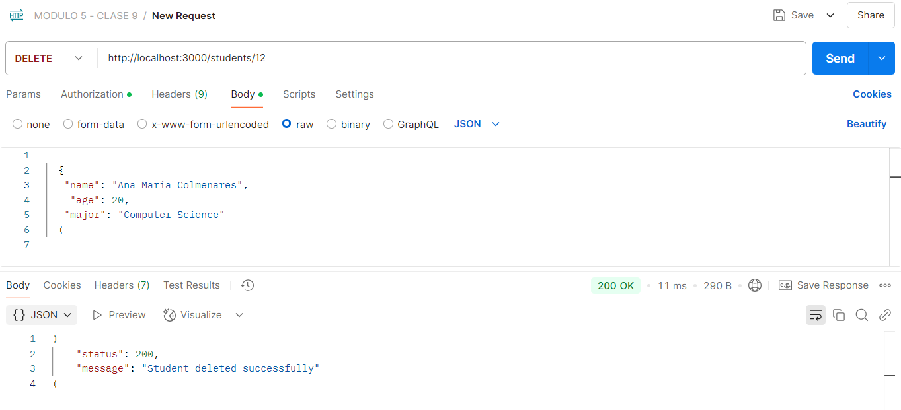

# API con Express y Middlewares

Este proyecto es una API con Express y Middlewares. La API maneja un conjunto de estudiantes y permite realizar operaciones CRUD (Crear, Leer, Actualizar y Eliminar) utilizando peticiones HTTP.
En esta API, el id de los estudiantes son unicos y se generan de manera automatica. Los estudiantes se encuentran en una base
de datos y las funciones en una carpeta por separado. 
En otra base de datos se crean los usuarios, contraseñas y tokens para cada uno de estos haciendo uso de middlewares.
Se realiza validación de la información en el nombre, edad y especialidad.
La API estará corriendo en el puerto 3000.

## Endpoints disponibles

### Obtener todos los estudiantes
**Ruta:** GET /students  
**Respuesta:** Lista de todos los estudiantes en formato JSON.


### Obtener un estudiante por ID
**Ruta:** GET /students/:id  
**Parámetros:** id (string) - ID del estudiante a obtener.  
**Respuesta:** Detalles del estudiante en formato JSON.


### Crear un nuevo usuario
**Ruta:** POST /register  
**Cuerpo de la petición:** JSON con los siguientes campos:
```bash
{
  "username": "Nuevo usuario",
  "password": "Contraseña"
}
```
**Respuesta:** User register successfully.


### Crear un token después de entrar con el usuario
**Ruta:** POST /login  
**Cuerpo de la petición:** JSON con los siguientes campos ya creados:
```bash
{
  "username": "Nuevo usuario",
  "password": "Contraseña"
}
```
**Respuesta:** Login successful.


### Crear un nuevo estudiante
**Ruta:** POST /students  
**Necesita autorización:**  Se debe colocar el token generado.  
**Cuerpo de la petición:** JSON con los siguientes campos:

```bash
{
  "name": "Nuevo estudiante",
  "age": "Edad",
  "major": "Especialidad"
}
```
**Respuesta:** Student fetched successfully.


### Actualizar un estudiante
**Ruta:** PUT /students/:id  
**Parámetros:** id (string) - ID del estudiante a actualizar.  
**Necesita autorización:**  Se debe colocar el token generado.  
**Cuerpo de la petición:** JSON con los siguientes campos:
```bash
{
  "name": "Nuevo estudiante",
  "age": "Edad",
  "major": "Especialidad"
}
``` 
**Respuesta:** Student updated successfully.


### Eliminar un estudiante
**Ruta:** DELETE /students/:id  
**Necesita autorización:**  Se debe colocar el token generado.  
**Respuesta:** Student deleted successfully



## Validación

**Ruta:** POST /students o PUT /students/:id  
**Cuerpo de la petición:** JSON con los siguientes campos:
```bash
{
  "name": // Vacio o diferente a string
  "age": "Edad",
  "major": "Especialidad"
}
```
**Respuesta:** Name cannot be empty or null.


**Ruta:** POST /students o  PUT /students/:id  
**Cuerpo de la petición:** JSON con los siguientes campos:
```bash
{
  "name": "Nuevo estudiante",
  "age": // Diferente a number
  "major": "Especialidad"
}
```
**Respuesta:** Age must be a non-negative number.


**Ruta:** POST /students o PUT /students/:id  
**Cuerpo de la petición:** JSON con los siguientes campos:
```bash
{
  "name": "Nuevo estudiante",
  "age": "Edad",
  "major": // Vacio o diferente a string
}
```
**Respuesta:** Major cannot be empty or null.


**Ruta:** POST /register  
**Cuerpo de la petición:** JSON con los siguientes campos:
```bash
{
  "username": "Usuario ya creado",
  "password": "Contraseña"
}
```
**Respuesta:** Username already exists.


**Ruta:** POST /students,  PUT /students/:id  o DELETE /students/:id  
**Necesita autorización:**  No se coloca el token generado  
**Respuesta:** Unauthorized.  


